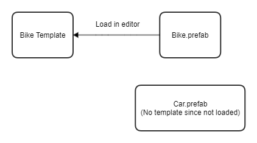
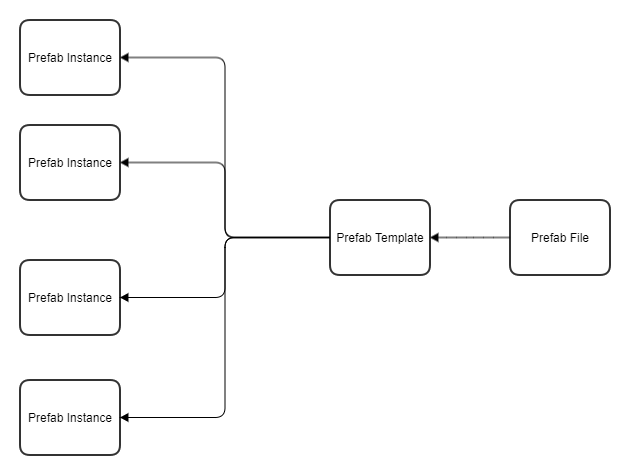
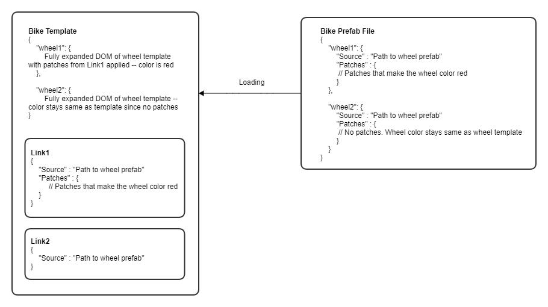
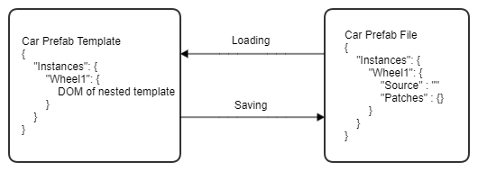
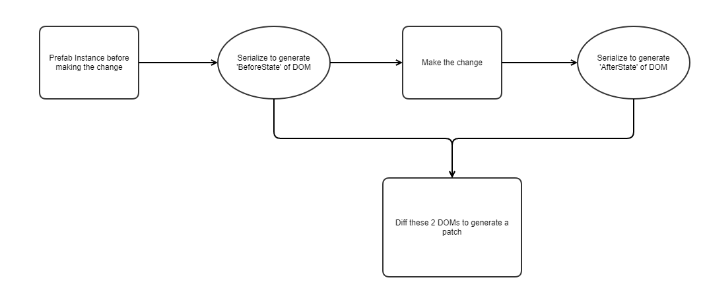
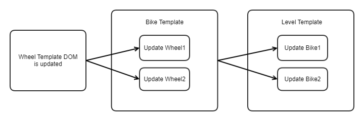

## Glossary
<!-- <a name="glossary"> -->

| Name            | Description |
| :-              | :-          |
| Entity          | A collection of components that define the properties and behavior of the entity. |
| Component       | A grouping of properties that helps define the behavior of the entity. |
| Prefab Template | An in-memory representation of the prefab. It represents the current state of prefab loaded in memory. This includes the file loaded from disk and any changes you applied on top of it. |
| Prefab Instance | The actual prefab game object that is instantiated by using the prefab template. A single prefab template can be used to instantiate any number of prefab instances. |
| Link            | An object used to express the connection between a source template and a target template. It contains a list of patches. |
| Patch           | Represents a JSON patch that is applied on top of the nested prefab instance to distinguish it from other nested instances that are instantiated from the same template (the source template). |
| DOM             | Stands for Document Object Model. It is a language agnostic logical model that represents any object data in a tree-like hierarchical structure where each node in the tree holds some relevant information about the data. In prefab system, DOM values are represented by [RapidJSON](https://rapidjson.org/) objects. Prefab DOM types are defined in [`PrefabDomTypes`](https://github.com/o3de/o3de/blob/development/Code/Framework/AzToolsFramework/AzToolsFramework/Prefab/PrefabDomTypes.h). |


## Overview
<!-- <a name="overview"> -->

To get an understanding of what prefabs are, we first need to understand what entities are. Entities are the foundational game objects that encapsulate logic required to build game worlds. An entity is made up of components that define its properties. More information about entities and components can be found in [Guide to Component Development](https://www.o3de.org/docs/user-guide/programming/components/). 

Prefabs serve the purpose of easily building and modifying large and complex worlds for games. Creating large worlds often requires duplicating a lot of entities in the world. While this can be done by simply creating a bunch of entities and duplicating them in the editor, modifying them becomes a pain point since you would have to go into each of those entities and make the same changes. You would also have to come up with custom tracking mechanisms to identify which entities to modify in which areas of the world. In addition, you may also want some entities to retain their old properties and not to change along with other entities. All of these problems are resolved by prefabs.

Simply put, a prefab is a collection of entities and nested prefabs. The further sections will explain how this collection of entities and nested prefabs are used to solve the above problems and many more.


### Prefab file format
<!-- <a name="prefab-file-format"> -->

Prefab files use JSON format. A prefab file has the following fields.

<dl>
  <dt>Container Entity</dt>
  <dd>A wrapper entity, which is the parent of all other entities and nested prefabs contained within a prefab. This is also used to distinguish prefabs from regular entities in the <a href="https://www.o3de.org/docs/user-guide/editor/entity-outliner/"><b>Entity Outliner</b></a>. A prefab must have a single container entity.</dd>

  <dt>Entities</dt>
  <dd>A container for entities owned by a prefab. A prefab may contain zero or more nested entities.</dd>

  <dt>Instances</dt>
  <dd>A container for nested prefabs owned by a prefab. A prefab may contain zero or more nested prefabs.</dd>

  <dt>Source</dt>
  <dd>The relative path to the prefab file that the nested prefab needs to load from.</dd>

  <dt>Patches</dt>
  <dd>A list of changes that get applied on top of the nested prefab.</dd>
</dl>

For example, this is a prefab that contains a single entity and a single nested prefab:

<details>
<summary>Car.prefab</summary>

```json
{
    "ContainerEntity": {
        "Id": "ContainerEntity",
        "Name": "Car",
        "Components": {
            "Component_[12748530028122391598]": {
                "$type": "SelectionComponent",
                "Id": 12748530028122391598
            },
            "Component_[13392385766383931996]": {
                "$type": "EditorOnlyEntityComponent",
                "Id": 13392385766383931996
            },
            "Component_[14257310886211380255]": {
                "$type": "EditorInspectorComponent",
                "Id": 14257310886211380255
            },
            "Component_[14614886844957924847]": {
                "$type": "EditorEntitySortComponent",
                "Id": 14614886844957924847,
                "Child Entity Order": [
                    "Entity_[1245636963768]"
                ]
            },
            "Component_[14902063945494347948]": {
                "$type": "EditorPendingCompositionComponent",
                "Id": 14902063945494347948
            },
            "Component_[1719713518280800294]": {
                "$type": "EditorVisibilityComponent",
                "Id": 1719713518280800294
            },
            "Component_[1762295132015522048]": {
                "$type": "EditorEntityIconComponent",
                "Id": 1762295132015522048
            },
            "Component_[17657882952245439542]": {
                "$type": "{27F1E1A1-8D9D-4C3B-BD3A-AFB9762449C0} TransformComponent",
                "Id": 17657882952245439542,
                "Parent Entity": ""
            },
            "Component_[18430199545970438248]": {
                "$type": "EditorLockComponent",
                "Id": 18430199545970438248
            },
            "Component_[4138408407469934805]": {
                "$type": "EditorDisabledCompositionComponent",
                "Id": 4138408407469934805
            },
            "Component_[6522218679447316383]": {
                "$type": "EditorPrefabComponent",
                "Id": 6522218679447316383
            }
        }
    },
    "Entities": {
        "Entity_[1245636963768]": {
            "Id": "Entity_[1245636963768]",
            "Name": "Engine",
            "Components": {
                "Component_[10189105590972799159]": {
                    "$type": "EditorInspectorComponent",
                    "Id": 10189105590972799159,
                    "ComponentOrderEntryArray": [
                        {
                            "ComponentId": 15807988307212229253
                        }
                    ]
                },
                "Component_[1115340051766175588]": {
                    "$type": "EditorVisibilityComponent",
                    "Id": 1115340051766175588
                },
                "Component_[11897666328730413911]": {
                    "$type": "EditorDisabledCompositionComponent",
                    "Id": 11897666328730413911
                },
                "Component_[12786378132283821322]": {
                    "$type": "EditorEntitySortComponent",
                    "Id": 12786378132283821322
                },
                "Component_[1300055106168418593]": {
                    "$type": "EditorPendingCompositionComponent",
                    "Id": 1300055106168418593
                },
                "Component_[15030307130975739594]": {
                    "$type": "SelectionComponent",
                    "Id": 15030307130975739594
                },
                "Component_[15807988307212229253]": {
                    "$type": "{27F1E1A1-8D9D-4C3B-BD3A-AFB9762449C0} TransformComponent",
                    "Id": 15807988307212229253,
                    "Parent Entity": "ContainerEntity",
                    "Transform Data": {
                        "Translate": [
                            0.0,
                            -4.999996185302734,
                            0.0
                        ]
                    }
                },
                "Component_[5492938519155614766]": {
                    "$type": "EditorEntityIconComponent",
                    "Id": 5492938519155614766
                },
                "Component_[8499539744869616376]": {
                    "$type": "EditorOnlyEntityComponent",
                    "Id": 8499539744869616376
                },
                "Component_[9386536730188669959]": {
                    "$type": "EditorLockComponent",
                    "Id": 9386536730188669959
                }
            }
        }
    },
    "Instances": {
        "Instance_[1211277225400]": {
            "Source": "Prefabs/Wheel.prefab",
            "Patches": [
                {
                    "op": "replace",
                    "path": "/ContainerEntity/Components/Component_[16182207544533401071]/Parent Entity",
                    "value": "../ContainerEntity"
                },
                {
                    "op": "replace",
                    "path": "/ContainerEntity/Components/Component_[16182207544533401071]/Transform Data/Translate/1",
                    "value": 4.999995231628418
                },
                {
                    "op": "replace",
                    "path": "/ContainerEntity/Components/Component_[16182207544533401071]/Transform Data/Translate/2",
                    "value": 0.012969493865966797
                }
            ]
        }
    }
}
```
</details>

To see what prefabs and entities look like in the Entity Outliner, see [Entity and Prefab Basics](https://www.o3de.org/docs/learning-guide/tutorials/entities-and-prefabs/entity-and-prefab-basics/).

### Prefab template
<!-- <a name="prefab-template"> -->

A *prefab template* is an in-memory representation of the prefab. It represents the current state of prefab loaded in memory. This includes the file DOM loaded from disk and additional metadata as needed. When loaded, you can keep making more changes to the template DOM without needing to save the template to file for each edit. In addition, the template object stores a container of link objects which represent the connection between this template and other templates.

Each template has a unique identifier `TemplateId`, which is an unsigned integer assigned by `PrefabSystemComponent`. The mapping of a template id to a a template object is maintained in the system component. A prefab template has a one-to-one relationship with the prefab file.

For example, if there is one prefab file called `Bike.prefab`, there will be only one template associated with it. A template will only be created if a prefab is loaded into the editor.



| Code | Description |
| :-   | :-          |
| [Template](https://github.com/o3de/o3de/blob/development/Code/Framework/AzToolsFramework/AzToolsFramework/Prefab/Template/Template.h) | Class that represents the template objects created while loading prefabs. |
| [PrefabSystemComponent](https://github.com/o3de/o3de/blob/development/Code/Framework/AzToolsFramework/AzToolsFramework/Prefab/PrefabSystemComponent.h) | Singleton system component that manages prefab objects like templates, links and instances. |


### Prefab instance
<!-- <a name="prefab-instance"> -->

A *prefab instance* defines a prefab object that represents the DOM stored in the prefab templates. Similar to the template DOM, the prefab instance has member variables for the container entity, entities and nested instances. There is a one-to-many relationship between a prefab template and prefab instances.

For example, if there is a Car prefab on file, there will be one Car template defined. Many instances can be generated using that single car template. Prefab instances can be populated by deserializing DOM into instance objects using `InstanceSerializer::Load()` method. Prefab instances can also be built from the ground up by adding entities to them directly. Similar to templates, prefab instances can be converted into DOM format by using `InstanceSerializer::Store()` method. Prefab serialization and deserialization will be discussed in detail in a following section.



| Code | Description |
| :-   | :-          |
| [Instance](https://github.com/o3de/o3de/blob/development/Code/Framework/AzToolsFramework/AzToolsFramework/Prefab/Instance/Instance.h) | Class that represents the instance objects instantiated from prefab templates. |
| [InstanceSerializer](https://github.com/o3de/o3de/blob/development/Code/Framework/AzToolsFramework/AzToolsFramework/Prefab/Instance/InstanceSerializer.cpp) | Class that loads DOMs into prefab instances and stores prefab instances into DOMs. |


### Prefab link
<!-- <a name="prefab-link"> -->

A *prefab link* defines how two templates are connected. A link exists between two templates, identified by a `LinkId` (a unique integer like `TemplateId`) and defined by a source template id and a target template id. The target template is the one which has a nested instance in it that points to a source template.

```
Bike       (Bike.prefab)
| Wheel    (Wheel.prefab)
```

In the above example of link between Bike and Wheel templates, the target template would be the one corresponding to `Bike.prefab` file and the source template would be the one corresponding to `Wheel.prefab` file. When the target template is loaded, the prefab system component creates a link between the two relevant templates and maintains a mapping of link ids to link objects.

One of the key members of a link object is the link DOM, which contains a file path to the source template and a list of patches to be applied on the source template. A link DOM may or may not contain patches in it. In the case where there are no patches, the target template would simply fetch the template DOM of the source template.

> **Note**
> In the latest development branch, a link maintains a `PrefabOverridePrefixTree` rather than a link DOM. The link DOM will be generated from the tree on the fly. This supports the new **Prefab Override** feature.



| Code | Description |
| :-   | :-          |
| [Link](https://github.com/o3de/o3de/blob/development/Code/Framework/AzToolsFramework/AzToolsFramework/Prefab/Link/Link.h) | Class that represents the link objects connecting two prefab templates. |


## Loading and saving prefab
<!-- <a name="loading-and-saving"> -->

When a prefab file is loaded, we create a prefab template associated with it. Similarly, when a prefab needs to be stored into a file, we take the corresponding template and save it into the file. This process is achieved by `PrefabLoader` and it follows three key steps of processing template DOMs:

1. Create template DOM from JSON string
1. Unfold nested instances
1. Sanitize prefab templates


### Create template DOM from JSON string
<!-- <a name="create-template-dom-from-json-string"> -->

Given a file path, `PrefabLoader` is able to read the raw JSON string from a prefab file. In order to easily and efficiently manipulate data in the string, the loader converts the string to a `PrefabDom`, which is a RapidJSON document object.

Below is a simplified DOM example of `Level.prefab`:

```json
{
    "ContainerEntity": {
        "Id": "Entity_[1146574390643]",
        "Name": "Level",
        "Components": { }
    },
    "Entities": {
        "Entity_1": { } 
    }
    "Instances": {
        "Nested_Instance_1": {
            "Source": "filepath",
            "Patches": [ ]
        }
    }
}
```

After the conversion, the DOM is just a 1-1 representation of the JSON string. The actual content does not change. At this moment, the nested instance DOM is exactly what it looks like in file. The loader will follow the next step to expand the content in each nested instance.


### Unfold nested instances
<!-- <a name="unfold-nested-instances"> -->

As seen in the example above, the file only stores the path to the nested prefab file and the patches. However, for a prefab template to be fully loaded, we need to unfold any nested instance DOM and replace the condensed version of the DOM with the fully expanded DOM generated from the source template. The unfolding is required because we need to work with the exact entities and components described in the nested template during editor operations.

`PrefabLoader::LoadNestedInstances()` method defines how to unfold all the nested instances. If the source template of a nested instance is not loaded yet, it will recursively load the source template before unfolding. To avoid cyclical dependency issue, the loading method maintains a file path set to check if the template file is being processed.

After a nested instance is unfolded, a link object will be created to represent the connection between the target template and the nested instance of the source template. You can think there is a 1-1 mapping between an instance and a link. A target template may contain multiple nested instances and links.

When saving the template to disk, we condense the instance DOM back to the state where it only shows the **Source** and **Patches** fields as they are in the nested template.




### Sanitize prefab templates
<!-- <a name="sanitize-prefab-templates"> -->

The default behavior of the JSON serializer will exclude default values of types from being serialized to JSON. For example, if you have a component with a property whose default value is zero, unless the value is non-zero, the property will be stripped out when the component is serialized to produce JSON. The purpose behind this is to keep the serialized JSON string in files compact. Unfortunately, this makes loading JSON strings from files a bit tricky. If a value is not present in a file, it cannot be read at all.

To prevent this from happening, you can define custom serializers to indicate what default values a certain field should take while loading. However, we cannot expect all components and types to have one custom serializer defined for sure. Therefore, during loading we add a sanitization phase where we temporarily serialize the same file with default values written out in place so that we can read from them. The opposite is done during saving where we temporarily serialize the file to strip out default values.


| Code | Description |
| :-   | :-          |
| [PrefabLoader](https://github.com/o3de/o3de/blob/development/Code/Framework/AzToolsFramework/AzToolsFramework/Prefab/PrefabLoader.h) | Class that does the heavy lifting for loading prefab files to templates and saving templates to prefab files. |


## Level as prefab
<!-- <a name="level-as-prefab"> -->

All entities and prefabs are placed under a level. A level is just another prefab. Like other prefabs, the level prefab must have one container entity and can include entities and instances if any.

```json
{
    "ContainerEntity": {
        "Id": "Entity_[1146574390643]",
        "Name": "Level",
        "Components": { }
    },
    "Entities": { },
    "Instances": { }
}
```

Unlike other prefabs, there can be only one instance created from the level template, which is the level instance (or root instance). It is an instance owned and managed by `PrefabEditorEntityOwnershipService` and the name of its container entity is hard coded to "Level".

The process of loading and saving a level follows what we have described above about loading and saving templates. Since it is the one that owns everything, it is loaded first and all other nested templates are then recursively loaded.


| Code | Description |
| :-   | :-          |
| [PrefabEditorEntityOwnershipService](https://github.com/o3de/o3de/blob/development/Code/Framework/AzToolsFramework/AzToolsFramework/Entity/PrefabEditorEntityOwnershipService.h) | Singleton class that owns and manages the level prefab instance. |


## Propagation
<!-- <a name="propagation"> -->

One of the key mechanisms prefabs support is propagation. It means modifying one prefab instance and easily replicating the same changes to all the other prefab instances. For example, modifying the color of one wheel instance and replicating the change to all the wheels in the level. There can be different types of changes we may want to propagate such as modifying entities, removing components, adding nested prefabs, etc. But no matter what the type is, the flow of a propagation event looks like something below:


Propagation is an important mechanism that keeps templates, instances and links in sync after changes are applied. We start by making changes to an instance, then bringing the changes to the template it belongs to, and finally propagating the changes to all instances registered by the template. The flow of changes can be divided into three parts:
1. Patch generation
1. Template-template propagation
1. Template-instance propagation


### Patch generation
<!-- <a name="patch-generation"> -->

After we make changes to an instance, for example, updating its owning entity’s position, we want to bring these changes to its corresponding template. `InstanceToTemplatePropagator` provides a couple of helper functions that generate DOMs from an instance object before and after the changes are applied, create JSON difference patches between the generated DOMs, as well as apply the patches to the template DOM.

```
Level
| Car        (Car.prefab)
  | Engine   <-- change position
```

In the above example, we have a Car prefab instance that contains an Engine entity. We update the position of the engine. Two instance DOMs are generated before and after the changes are applied to the car. A JSON patch is generated that represents the difference between the two DOMs, that is, the position of the engine. The patch will then be applied to the car template DOM so the template will reflect the latest state. Once the template is updated, it should be ready for template-template propagation, which is covered in the next section.

The objective here is to generate a patch and there are multiple ways to do that. Over the time, we have worked on multiple optimizations to the patch generation process to make it faster for some operations.

#### By serializing the instance object twice
1. Serialize the instance before applying changes to generate **before-state instance DOM**.
1. Apply the changes.
1. Serialize the instance after applying changes to generate **after-state instance DOM**.
1. Compare both states and generate patches.




#### By serializing relevant entities only

The above approach works but has the downside of taking a lot of time to convert an instance object into a DOM, particularly when we make a small change like modifying a single entity among 1,000 entities in the prefab. To get around that, we can follow these steps:

1. Serialize the entity before applying the change to generate **before-state entity DOM**.
1. Apply the changes.
1. Serialize the entity after applying the change to generate **after-state entity DOM**.
1. Compare both states and generate patches.
1. Add required path prefix(s) to make the patches valid.
    * For example, the patches would be generated with paths like `ComponentA/...` but we also need to add the entity path prefix to it to know which entity within the prefab we are referring to. The path with prefix would become `/Entities/Entity1/Components/ComponentA/...`.

> **Note**
> To be able to do this way though, we need to know that we would be only modifying a single entity or a group of entities. So this is used only for changes like entity updates.


#### By using template DOM as before state

One interesting observation is that we do not need to serialize the instance or entity to get a before-state DOM because that information should already be present in the corresponding prefab template. So we can skip that serialization step.

1. Get the **before state of instance or entity DOM** by fetching it from the corresponding template.
1. Apply the changes.
1. Serialize the instance or entity after applying the changes to generate the **after-state DOM**.
1. Compare both states and generate patch.
1. Add required path prefix(s) to make the patches valid as we do in the previous case.


#### By generating patches without serializing

If we know what operation the you want to do like adding or removing an entity, we do not need to serialize the entire instance or entity to get the after state of DOM. We can be smart about it and create a patch by ourselves.

Based on the operation, we create a patch that has **op**, **path** and **value** fields to match the JSON patch standards.

> **Note**
> This only works for simple operations like adding or removing an entity but may not work for more complex use cases like modifying a particular component. With **Document Property Editor (DPE)** patches, this can change in the future though.


#### Best effort patching

We use the JSON serializer's default patch application mechanism to apply patches on an instance or entity DOM. If an error occurs while applying an array of patches, the patch application will immediately halt. However, for prefabs, there could be stale patches or the system might have generated an incorrect patch due to a bug. In these cases, to prevent data loss, we implement best effort patching wherein we apply one patch at a time and skip the patches that result in error. At the end of patch application, we send a warning message that indicates what patches could not be applied.

| Code | Description |
| :-   | :-          |
| [InstanceToTemplatePropagator](https://github.com/o3de/o3de/blob/development/Code/Framework/AzToolsFramework/AzToolsFramework/Prefab/Instance/InstanceToTemplatePropagator.h) | Class that defines helper functions that generate DOM values from instances and entities. |


### Template-template propagation
<!-- <a name="template-template-propagation"> -->

In template-template propagation, we update all dependent templates with the latest DOM values. Target template DOM includes instance DOMs that are generated from source template DOMs. Source template DOMs have to be up to date in the first place in order to allow target template DOM to pick up the latest changes.

```
Level
| Bike1       (Bike.prefab)
  | Wheel1    (Wheel.prefab)
  | Wheel2    (Wheel.prefab)
| Bike1       (Bike.prefab)
  | Wheel1    (Wheel.prefab)
  | Wheel2    (Wheel.prefab)
```

For example, if we have a level like above and we update the DOM of the Wheel prefab instance's template. This is what the template-template propagation process would look like:



| Code | Description |
| :-   | :-          |
| [PrefabSystemComponent](https://github.com/o3de/o3de/blob/development/Code/Framework/AzToolsFramework/AzToolsFramework/Prefab/PrefabSystemComponent.h) | The `PrefabSystemComponent::PropagateTemplateChanges()` method does the work of regenerating all nested instance DOMs by updating the links with latest DOM values. |


### Template-instance propagation
<!-- <a name="template-instance-propagation"> -->

As seen above, when a template gets updated, it will trigger the updates for dependent templates. After that processs ends, we still need to update the actual prefab instances in the scene. This is where template-instance propagation comes into the picture. All the prefab instances that are created from a prefab template will be put into a queue. Upon next system tick, all instances in the queue will be updated by selectively deserializing template DOMs to the prefab instance objects with patches applied.

Based on the same example above of the level having two Bike prefabs, this is what the template-instance propagation would look like:


The instance DOM used for deserialization corresponds to the instance as seen from the topmost template (level) in the hierarchy since it accounts for all possible overrides that may be applied to the instance. When the prefab being edited is not the level but some nested prefab within the level, then that prefab will become the topmost template and the DOM used will be the DOM as seen from that template.

#### Selective deserialization

The JSON deserializer is additive and does not provide an out-of-the-box solution to selectively deserialize only the modified values. So the contents of a prefab instance used to be cleared out and deserialized from scratch. However, this did not scale well as prefabs grow in size or the number of prefab instances grow in size. Moreover, several other systems listen and respond to changes to entities and recreating them from scratch added more computational cost coming from those systems too. To solve these issues, _selective deserialization_ was introduced to do the following:

1. We cache the DOM used for deserialization in the instance object. If the instance does not have a cached instance DOM, we will clear and reload everything just like before. But if there was a cached instance DOM, we use it to compare against the current DOM and generate JSON patches.
1. We then iterate through the patches and identify which entities need to be reloaded by inspecting the patch paths.
1. The deserializer only clears the contents of those particular entities and deserialize them from the DOM provided.
1. For adding and deleting entities, it takes advantage of the entity aliases already stored under the instance to modify the related entities without affecting other entities.
1. Repeat step 3 and 4 for nested instances stored under a prefab instance using instance aliases instead.


| Code | Description |
| :-   | :-          |
| [InstanceUpdateExecutor](https://github.com/o3de/o3de/blob/development/Code/Framework/AzToolsFramework/AzToolsFramework/Prefab/Instance/InstanceUpdateExecutor.h) | Class that manages template-instance propagation. At the end of `PrefabComponentSystem::PropagateTemplateChanges()` method, it delegates the template-instance propagation job to `InstanceUpdateExecutor`. |
| [InstanceSerializer](https://github.com/o3de/o3de/blob/development/Code/Framework/AzToolsFramework/AzToolsFramework/Prefab/PrefabPublicInterface.h) | Class that defines how to deserialize DOMs into instance objects. Deserialization happens in the `PrefabDomUtils::LoadInstanceFromPrefabDom()` method and the JSON serializer for prefabs is defined by `InstanceSerializer`. |


## Prefab editor workflows
<!-- <a name="prefab-editor-workflows"> -->

The above sections cover core API features of prefabs and give an idea of how the prefab system works. This section will cover how prefabs are integrated into the O3DE editor and how internally to create, modify and delete entities and prefabs.

In general, all of these below workflows follow this pattern:


> **Note**
> The only exceptions to this are the duplicate workflows where instead of updating the prefab instances first, we take a DOM authoritative approach where we let propagation create the duplicate objects.

| Code | Description |
| :-   | :-          |
| [PrefabPublicInterface](https://github.com/o3de/o3de/blob/development/Code/Framework/AzToolsFramework/AzToolsFramework/Prefab/PrefabPublicInterface.h) | Interface that the public handler implements. The publicly exposed functions in PrefabPublicInterface can be called through Python scripting and are used to write automated tests for prefabs. |
| [PrefabPublicHandler](https://github.com/o3de/o3de/blob/development/Code/Framework/AzToolsFramework/AzToolsFramework/Prefab/PrefabPublicHandler.cpp) | Class that implements the prefab public interface. `PrefabPublicHandler` is the class that implements the prefab editor workflows. Internally, it calls prefab APIs defined in `PrefabEditorEntityOwnershipService` and `PrefabSystemComponent`. |


### Create entity
<!-- <a name="create-entity"> -->

You can create a new entity owned by a prefab. The prefab is called the owning prefab instance. The new entity is by default created under the container entity of the prefab being edited, otherwise the new entity is created under the entity selected.

The following diagram demonstrates how a new Engine entity is added to a Car prefab instance:


### Create prefab
<!-- <a name="create-prefab"> -->

You can select a number of entities and prefabs that share a common owning prefab and share a common root parent and put them under a new prefab. In order to do so, the selected entities and prefabs should be removed from the owning template and then moved into the newly created template.

```
RaceTrack    (RaceTrack.prefab)
| Wheel      (Wheel.prefab)      <-- select this
| Engine                         <-- select this
| Road
```

In the above example, if you want to select the Wheel prefab and Engine entity and make a prefab out of them, this is what the workflow would look like:


When a template is removed from another template, we need to remove the link between the two templates too. It means deleting the `Link` object held in `PrefabSystemComponent`. The link between Wheel prefab and RaceTrack is deleted in the process of the above example.

Similarly, a new `Link` object must be created between the newly created prefab and the owning prefab it is put under. In the above example, a new link is created between Car prefab and RaceTrack prefab. After propagation, all other instances of RaceTrack prefab will get these changes too. If there are ten RaceTrack instances, inside all of them, a new Car instance will appear.


### Instantiate prefab
<!-- <a name="instantiate-prefab"> -->

You can create a new prefab instance from a prefab template on disk. The template can be loaded or not loaded before instantiation; if not loaded, `PrefabLoader` will load the template first. The new prefab instance is by default created under the container entity of the prefab being edited, otherwise the new instance is created under the entity selected.

Unlike **Create entity**, this workflow includes extra work on creating a link between the template being instantiated from and the owning prefab it is put under.

The following diagram demonstrates how a Wheel prefab is instantiated and added to a Car prefab as a nested instance:


### Delete entities and nested prefabs
<!-- <a name="delete-entities-and-nested-prefabs"> -->

You can select a number of entities and prefabs and remove them from the owning template. The selected items need to share a common owning prefab, otherwise the operation would not succeed. When an entity is deleted, the workflow will also delete all the entity's descendant entities and prefab instances.

```
Car        (Car.prefab)
| Wheel    (Wheel.prefab)
| Engine                   <-- select this
  | Piston
  | Distributor
| Seats
  | Seat   (Seat.prefab)   <-- select this
```

In the above example, if you select Engine entity and Seat prefab, two lists will be generated for deletion:
1. **Entity List:** Engine, Piston, Distributor
1. **Nested Prefab List:** Seat

The following diagram demonstrates what the workflow looks like:


### Detach prefab
<!-- <a name="detach-prefab"> -->

You can select a prefab instance and detach it in Entity Outliner. By detaching, it means:

1. Converting the container entity of the selected prefab into a regular entity. This entity has the same parent as the container entity has.
1. Putting all entities and nested prefab instances (owned by the selected prefab) under the entity.
It is an opposite operation of **Create prefab**.

> **Note**
> You can detach only one prefab at a time. If multiple prefabs are selected, the **Detach Prefab...** option would not appear in the context menu.

```
Car       (Car.prefab)
| Wheel   (Wheel.prefab)    <-- select this
Wheel     (Wheel.prefab)
| Tire    (Tire.prefab)
| Rim
| Hub
```

In the above example, if you select the Wheel prefab under the Car prefab and detach it, all descendants of Wheel prefab will be put under a new Wheel entity under Car prefab instance. The following diagram demonstrates what the workflow looks like:


### Duplicate entities and prefabs
<!-- <a name="duplicate-entities-and-prefabs"> -->

You can select a number of entities and prefabs and duplicate them in Entity Outliner. All selected should be owned by the same prefab instance, otherwise the operation would not succeed.

> **Note**
> Duplication of an entity will duplicate all its descendants.

```
Garage_Small
| Brooms                     <-- select this
  | Broom_1
  | Broom_2
Garage_Large
| Car         (Car.prefab)   <-- select this
```

In the above example, if you select the Brooms entity and the Car prefab and duplicate them, the duplication will lead to entity and prefab instance creation:

1. A new entity Brooms (with Broom_1 and Broom_2) will be created. Brooms' parent is Garage_Small.
1. A new nested prefab instance Car will be created. The prefab's parent is Garage_Large.

The following diagram demonstrates what the workflow looks like.


> **Note**
> The second step is surrounded with dot lines. As we mentioned above, for this particular operation, we currently generate patches and apply the patches directly on the template DOM. It is a template DOM authoritative approach. The prefab instance object will be updated during propagation.